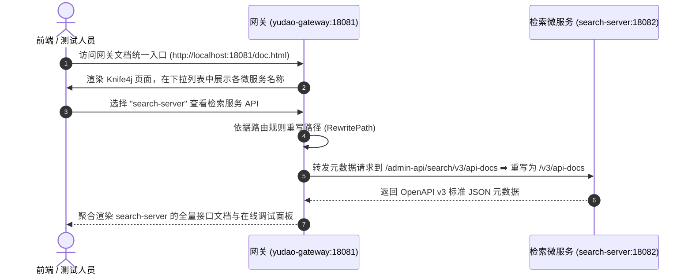

[← 返回主技术说明文档](../全文检索服务构建与学习文档.md)

# OpenAPI v3 (Swagger 3) 规范与 Knife4j 微服务聚合文档设计规范

本文档阐述 API 规范演进历程（Swagger 2.0 ➡️ OpenAPI 3.0）、Knife4j 增强 UI 框架工作原理，以及在 Spring Cloud 微服务网关架构下 API 文档的聚合分发与注解使用规范。

---

## 1. OpenAPI v3 与 Swagger 的技术演进历程

### 1.1 Swagger 与 OpenAPI Specification (OAS)
*   **Swagger 规范**：最初由 SmartBear 公司主导推出的 RESTful API 描述规范（Swagger 1.x / 2.0）。通过在 Java 代码中标注注解，自动提取接口元数据并生成 JSON 格式的接口文档规范。
*   **OpenAPI 规范 (OAS)**：2015 年，SmartBear 将 Swagger 规范捐赠给 Linux 基金会并成立 OpenAPI Initiative，正式将该规范重命名为 **OpenAPI Specification (OAS)**。OpenAPI v3.0 为当前工业界的权威 API 描述标准。

### 1.2 框架替换与注解映射表 (Springfox ➡️ Springdoc)
在现代 Spring Boot (2.7+ / 3.X) 体系中，传统的 `springfox-swagger2` 已停止维护，由基于 OpenAPI v3 规范的 `springdoc-openapi` 替代。核心注解映射关系如下：

| Swagger 2.0 旧注解 (Springfox) | OpenAPI v3 新注解 (Springdoc) | 作用与使用位置 |
| :--- | :--- | :--- |
| `@Api(tags = "...")` | **`@Tag(name = "...")`** | 标注在 Controller 类上，定义接口分组名称 |
| `@ApiOperation(value = "...")` | **`@Operation(summary = "...")`** | 标注在 Controller 方法上，定义具体接口功能描述 |
| `@ApiParam` / `@ApiImplicitParam` | **`@Parameter(name = "...", description = "...")`** | 标注在方法入参上，定义请求参数含义及示例值 |
| `@ApiModel` / `@ApiModelProperty` | **`@Schema(description = "...")`** | 标注在 VO / DTO 实体类及其字段上，描述数据模型属性 |
| `@ApiIgnore` | **`@Hidden`** | 标注在类或方法上，控制在接口文档中隐藏该接口 |

---

## 2. Knife4j 增强 UI 框架

### 2.1 传统 Swagger UI 的工程痛点
原生 Swagger UI 界面样式简陋、不支持中文检索、调试时无法持久化 Header/Token、在大规模微服务环境下难以统一查看。

### 2.2 Knife4j 的核心优势与增强特性
Knife4j 是基于 OpenAPI v3 规范打造的现代增强型 API 文档 UI 框架，具备以下核心工程特性：
1.  **极佳的前端 UI 交互**：提供基于 Vue/Bootstrap 的响应式界面，支持接口按模块树形展开、在线全局关键词搜索。
2.  **全局 Header / Token 注入**：支持在调试界面配置全局鉴权参数（如 `Authorization: Bearer <token>`），在线发起 HTTP 测试时自动携带 Token，极大地提升了前后端联调效率。
3.  **文档导出与离线浏览**：支持将 OpenAPI 元数据一键导出为 Word、Markdown、PDF 及标准 JSON 报文。

---

## 3. 微服务网关 (yudao-gateway) 聚合 OpenAPI 文档原理

在分布式微服务架构中，每个独立的微服务（如 `search-server`、`system-server`）各自运行在不同的内部端口上。为了避免前端或测试人员分别访问各个微服务的 Swagger 页面，系统在网关 `yudao-gateway` 上实现了 **Knife4j 微服务聚合文档**。



### 3.1 网关层配置解析 ([application.yaml](../../yudao-gateway/src/main/resources/application.yaml))

在 `yudao-gateway` 的配置文件中，通过 `knife4j.gateway.routes` 配置聚合的子服务节点：

```yaml
knife4j:
  gateway:
    enabled: true
    routes:
      - name: search-server                      # 下拉列表中显示的微服务别名
        service-name: search-server              # Nacos 中注册的服务名
        url: /admin-api/search/v3/api-docs       # 通过网关拉取元数据的代理路径
```

### 3.2 网关路由重写 Filter 配合
为了保证网关拉取 `/admin-api/search/v3/api-docs` 时能正确转发给微服务底层的 `/v3/api-docs`，在 Gateway 路由表 [application.yaml](../../yudao-gateway/src/main/resources/application.yaml) 中配置了路径重写过滤器：

```yaml
- id: search-admin-api
  uri: grayLb://search-server
  predicates:
    - Path=/admin-api/search/**
  filters:
    - RewritePath=/admin-api/search/v3/api-docs, /v3/api-docs # 将前缀剥离，保证精准映射到 Springdoc 底层端点
```

---

## 4. 控制层 [SearchController.java](../../yudao-module-search/yudao-module-search-server/src/main/java/cn/iocoder/yudao/module/search/controller/admin/SearchController.java) 真实代码标注示例

```java
package cn.iocoder.yudao.module.search.controller.admin;

import io.swagger.v3.oas.annotations.Operation;
import io.swagger.v3.oas.annotations.Parameter;
import io.swagger.v3.oas.annotations.tags.Tag;
import org.springframework.web.bind.annotation.*;

@Tag(name = "管理后台 - 全文检索服务") // 定义模块分组名称
@RestController
@RequestMapping("/search")
public class SearchController {

    @GetMapping("/get")
    @Operation(summary = "获得文档") // 描述具体 API 功能
    @Parameter(name = "id", description = "文档编号", required = true, example = "60c72b2f9b1d8e2a1c8f4b5a") // 描述入参
    public CommonResult<SearchDocumentRespVO> getSearchDocument(@RequestParam("id") String id) {
        // 业务逻辑...
        return success(vo);
    }
}
```
