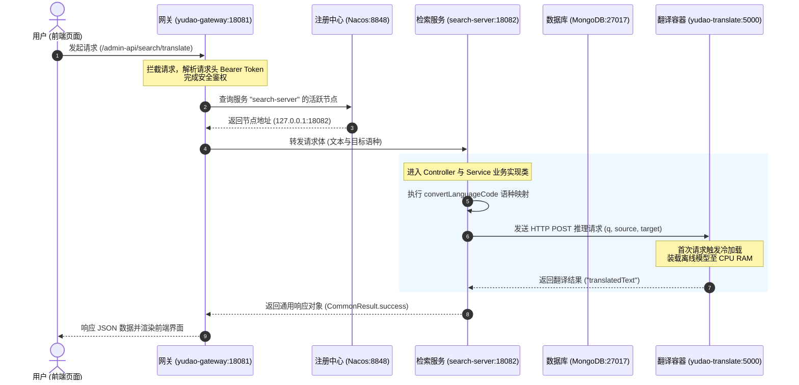

# 全文检索与离线翻译服务技术说明文档

本文档为 **全文检索微服务（search-server）** 与 **离线翻译 Sidecar 服务** 的技术架构、请求链路及工程实现说明文档。

---

## 1. 系统架构与技术选型

系统采用 Spring Cloud 微服务架构，结合 NoSQL 全文检索数据库与 Docker 伴生容器，构建闭环的全文检索与离线翻译服务：

*   **核心服务节点**：`yudao-module-search-server`（运行端口：18082）
*   **网关接入节点**：`yudao-gateway`（运行端口：18081）
*   **注册与配置中心**：Nacos Server（运行端口：8848）
*   **全文检索数据库**：MongoDB Server（运行端口：27017）
*   **离线翻译 Sidecar 容器**：`yudao-translate`（运行端口：5000）

---

## 2. 微服务请求调用链路

系统客户端（Vue3 前端页面）、网关路由、注册中心、全文检索微服务及离线翻译 Sidecar 容器的时序调用关系如下图所示：

---

## 3. 微服务工程实现与模块设计规范

### 3.1 Maven 模块结构与版本管控
微服务工程遵循 Maven 多模块结构划分。父工程通过 BOM（Bill of Materials）模式统一管理第三方依赖版本，防止依赖冲突。
*   **四层 POM 设计**：根聚合 POM ➡️ BOM 版本词典 ➡️ 业务父 POM ➡️ 微服务 Jar 模块 POM。

> **知识点**：
> *   [Maven 多模块划分与 BOM 版本管控规范](spring-cloud/maven-multi-module-and-bom.md)

---

### 3.2 基础设施对接、配置分工与启动类
服务启动与配置管理遵循现代 Spring Boot 2.4+ 标准规范。
*   **配置导入与覆盖**：废弃传统 `bootstrap.yaml`，采用 `spring.config.import` 机制动态引入 Profile 配置。按 `application.yaml`（基线）、`application-local.yaml`（本地开发）、`application-dev.yaml`（测试环境）进行属性分工，遵循“后加载覆盖先加载”规则。
*   **容器 Bean 管理**：对象全生命周期交由 Spring IoC 容器统一装配与管理，默认采用单体作用域（Singleton Scope）降低堆内存开销。
*   **启动入口**：通过 `SpringApplication.run(SearchServerApplication.class, args)` 启动内置 Tomcat 容器并完成 Nacos 注册。

> **知识点**：
> *   [Java 包机制、Main 函数入口与 SpringApplication 启动流程规范](java/class-loading-and-main-entry.md)
> *   [Java 注解 (@)、反射与代理机制规范](java/annotation-reflection-mechanism.md)
> *   [Spring Bean 体系、IoC 控制反转与 DI 依赖注入规范](spring-boot/spring-bean-and-ioc-di.md)
> *   [Spring Boot 多环境配置规范与 spring.config.import 机制](spring-boot/yaml-profiles-override.md)

---

### 3.3 网关路由分发与“单体+微服务”混合架构
所有外部请求统一由 `yudao-gateway` 进行安全拦截与转发。
*   **无代码侵入扩展**：网关基于配置驱动，新增微服务仅需在 YAML 中扩展路由节点，无需修改网关 Java 源码。
*   **混合架构兜底转发**：本地开发场景下，将未拆分基础模块保留在单体 `yudao-server`（18080 端口），通过通配断言 `Path=/admin-api/**` 兜底转发；独立拆分出的 `search-server`（18082 端口）通过高优先级精确断言 `Path=/admin-api/search/**` 进行优先分发。

> **知识点**：
> *   [Spring Cloud Gateway 网关路由分发与“单体+微服务”混合架构规范](spring-cloud/gateway-routing-and-fallback.md)

---

### 3.4 MongoDB 数据库与倒排索引全文检索
数据存储与检索基于 MongoDB 实现高召回率全文匹配。
*   **底层索引选择**：相比 MySQL `LIKE '%xx%'` 前置通配符导致最左前缀原则失效引发的全表扫描，MongoDB 使用倒排索引（Inverted Index）记录“词项 (Term) ➡️ 文档 ID 列表与权重”，实现 $O(1)$ 字典查找与基于 TF-IDF 算法的相关度打分（`$textScore`）。
*   **普通字段 vs 全文索引数据结构**：普通字段使用 B 树（B-Tree）提升单点 Lookup 性能，全文检索字段使用倒排索引。
*   **中文分词预处理**：集成 `jieba-analysis` 库对中文文本进行预切词，避免字符串连续性导致的检索漏召。

> **知识点**：
> *   [B 树 (B-Tree) 与 B+ 树 (B+ Tree) 底层节点存储结构与检索原理规范](database/btree-vs-bplustree-comparison.md)
> *   [MongoDB 全文检索、倒排索引与 Jieba 中文分词机制规范](database/mongodb-fulltext-and-inverted-index.md)

---

### 3.5 离线翻译 Sidecar 伴生微服务集成
针对涉密无网环境，采用 Sidecar 伴生模式集成 CTranslate2 / LibreTranslate 离线 NMT 推理服务。
*   **架构解耦**：避免在 Java 进程中通过 JNI 嵌入式调用 C++ 动态库导致内存泄漏与 JVM 崩溃风险。
*   **懒加载与超时调优**：CPU NMT 模型首次调用特定语种（如 `zh` ➡️ `ru`）时触发冷加载（耗时 5~10 秒）。将 `yudao.translate.timeout` 设为 30000ms（30 秒），消灭冷加载导致的网关 500 异常。
*   **Docker 部署**：通过持久化挂载 `-v ./translate-models:...` 实现离线模型包常驻。

> **知识点**：
> *   [Sidecar 伴生微服务模式、离线 NMT 模型懒加载与超时调优规范](architecture/sidecar-pattern-and-offline-nmt.md)

---

## 4. 运维排查与异常处理指南

### 4.1 网关返回 500 异常（链式 Setter 缺失）
*   **现象**：网关控制台抛出 `Cannot invoke method on primitive type void` 报错。
*   **原因**：Gateway 过滤器依赖 Lombok 链式 Setter，DTO 未标注 `@Accessors(chain = true)` 导致 Setter 返回 `void`。
*   **解决**：在相关 DTO 类上统一补充 `@Accessors(chain = true)` 注解。

### 4.2 首次翻译网络超时
*   **现象**：首次调用未载入语种翻译时抛出 `SocketTimeoutException`。
*   **原因**：CPU 离线推理模型懒加载耗时 5~10 秒，超出默认 5 秒 HTTP 超时限制。
*   **解决**：将配置文件中的 `yudao.translate.timeout` 调整为 `30000`（30 秒）。

### 4.3 Nacos 服务实例未发现 (503 Service Unavailable)
*   **现象**：网关日志提示 `Load balancer does not contain an instance for the service search-server`。
*   **原因**：`search-server` 未能成功注册到 Nacos，或 Nacos 命名空间（Namespace）、服务组（Group）与 Gateway 不一致。
*   **解决**：检查 `application.yaml` 中的 Nacos 配置项，确保命名空间（`dev`）与服务分组对齐。
