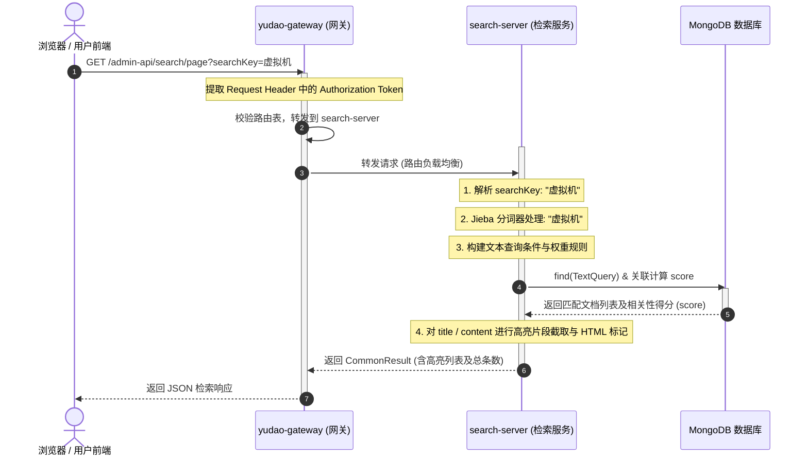

# 全文检索服务设计文档

本设计文档旨在阐述基于 **MongoDB Text Index (文本索引)** 与 **应用层前置中文分词 (Jieba)** 构建的高性能全文检索服务的设计与实现方案。

---

## 一、 技术选型与调研说明

### 1. MongoDB Text Index 核心机制
MongoDB 提供了原生的文本索引（Text Index）用于支持全文检索，具备以下特性与设计要点：
* **权重控制 (Weights)**：支持为不同的字段指定不同的检索权重，控制其对相关性得分的影响程度。在本设计中，权重的分配为：`title` = 10, `keywords` = 5, `content` = 1。
* **得分机制 (TextScore)**：检索时通过 `$meta: "textScore"` 投影获取文档与检索词的匹配度得分。MongoDB 内部会利用 TF-IDF 算法根据词频和文档频率计算该得分。检索结果默认按 `score` 降序排列。
* **索引限制**：每个集合（Collection）**只能拥有一个**文本索引，但该文本索引可以包含多个字段（即复合文本索引）。

### 2. 中文分词机制的局限性与突破
* **原生局限性**：MongoDB 官方原生的文本分词器仅支持英语等以空格/标点作为天然分词符的语言。对于中文等连续书写语言，原生分词器会将每个中文字符拆分为独立的 Token（单字索引），导致检索精度极差（如搜“数据库”会匹配到所有包含“数”、“据”、“库”的文档）。
* **应用层前置分词解决方案**：
  为彻底解决中文分词瓶颈，本项目在应用层引入了 **Jieba 中文分词器 (基于 `huaban-jieba-analysis`)** 进行前置处理：
  * **文档写入/导入阶段**：对要索引的 `title`、`keywords` 和 `content` 等字段在 MongoDB 存储时，采用分词引擎处理，转为以**空格分隔**的词流保存（或保持原文，由查询端进行检索词分词召回）。
  * **搜索查询阶段**：当用户输入查询关键字（如 `Java虚拟机`）时，服务层首先使用 Jieba 分词器将其拆分为词流（如 `Java 虚拟机`），然后再构建 MongoDB `TextCriteria` 执行匹配。这样，MongoDB 原生的空格分词机制就可以完美服务于中文检索。

---

## 二、 数据模型与结构设计

全文检索文档数据模型映射至 MongoDB 集合 `search_document`。

### 1. 物理结构设计
* **集合名称**：`search_document`
* **主键**：`id` (String 类型，自动映射为 MongoDB 的 `ObjectId`)
* **文本得分字段**：标注 `@TextScore`，用于接收 MongoDB 动态计算的相关性得分，不进行物理持久化。

### 2. Java DO 类定义
数据模型定义在 [SearchDocument.java](file:///d:/Projects/yudao-cloud/yudao-module-search/yudao-module-search-server/src/main/java/cn/iocoder/yudao/module/search/dal/mongodb/SearchDocument.java) 中：

```java
@Document(collection = "search_document")
@Data
public class SearchDocument {

    @Id
    private String id;

    @TextIndexed(weight = 10)
    private String title;

    @TextIndexed(weight = 5)
    private List<String> keywords;

    @TextIndexed(weight = 1)
    private String content;

    @TextScore
    private Float score;

    private Map<String, Object> extra;

    @Field("create_time")
    private Long createTime;
}
```

---

## 三、 接口定义与 API 详细说明

所有接口遵循 Yudao 统一的 HTTP 响应包装格式：`CommonResult<T>`。

### 1. 创建/索引文档 (POST `/admin-api/search/create`)
用于单条文档的写入或更新索引。
* **请求体** (JSON):
  ```json
  {
    "id": "6a563779280b1d443c4a36f1",
    "title": "Java 21 虚拟机性能优化",
    "keywords": ["Java 21", "JVM", "ZGC"],
    "content": "Java 21 引入了分代 ZGC...",
    "extra": { "author": "张三" }
  }
  ```
* **响应** (JSON):
  ```json
  {
    "code": 0,
    "msg": "",
    "data": "6a563779280b1d443c4a36f1"
  }
  ```

### 2. 获取文档详情 (GET `/admin-api/search/get`)
* **查询参数**: `id=6a563779280b1d443c4a36f1`
* **响应** (JSON):
  ```json
  {
    "code": 0,
    "msg": "",
    "data": {
      "id": "6a563779280b1d443c4a36f1",
      "title": "Java 21 虚拟机性能优化",
      "keywords": ["Java 21", "JVM", "ZGC"],
      "content": "Java 21 引入了分代 ZGC...",
      "createTime": 1784035193753,
      "extra": { "author": "张三" }
    }
  }
  ```

### 3. 分页检索与高亮召回 (GET `/admin-api/search/page`)
支持根据不同检索范围进行匹配，并返回关键词红色/黄色高亮和正文片段摘要。
* **查询参数**:
  * `pageNo`: 当前页码，默认 `1`
  * `pageSize`: 每页大小，默认 `10`
  * `searchType`: 检索类型（`all`: 全文, `title`: 标题, `content`: 正文）
  * `searchKey`: 检索关键字，如 `"ZGC"`
* **响应** (JSON):
  ```json
  {
    "code": 0,
    "msg": "",
    "data": {
      "total": 1,
      "list": [
        {
          "id": "6a563779280b1d443c4a36f1",
          "title": "Java 21 虚拟机性能优化：分代 ZGC 与 G1 垃圾收集器对比测试报告",
          "titleHighlight": "Java 21 虚拟机性能优化：分代 <mark style=\"...\">ZGC</mark> 与 G1 垃圾收集器对比测试报告",
          "keywords": ["Java 21", "JVM", "ZGC"],
          "content": "Java 21 引入了分代 ZGC...",
          "contentSnippetHighlight": "Java 21 引入了分代 <mark style=\"...\">ZGC</mark>（Generational <mark style=\"...\">ZGC</mark>）...",
          "score": 11.815,
          "createTime": 1784035193753,
          "extra": null
        }
      ]
    }
  }
  ```

---

## 四、 检索请求时序图

检索请求在微服务集群中的流转时序如下：


