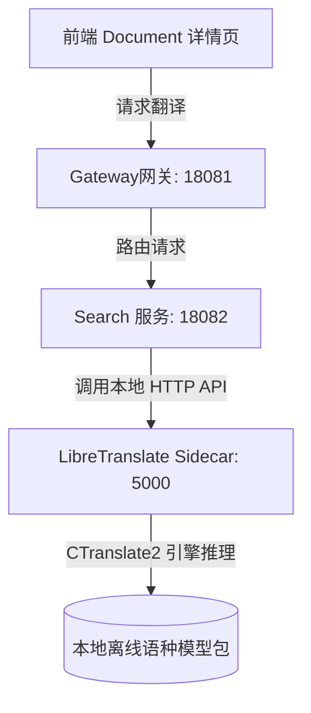

# 多语言翻译服务设计文档

## 1. 引言
在物理隔离的企业级应用场景中，联网的多语言翻译服务（如谷歌翻译、百度翻译等云端 API）由于数据合规性和安全审计原因无法被采用。为满足系统对于外文文献、元数据摘要的离线翻译需求，需要建立一套安全、低资源消耗且高性能的本地离线多语言翻译服务。本设计文档针对离线翻译服务的技术选型进行评估，并对所采用的伴生微服务（Sidecar）离线翻译架构提供详细的设计细节与部署指南。

---

## 2. 方案技术选型与对比评估

本系统对目前主流的本地离线神经网络翻译（NMT）技术进行了对比与评估，排除需要庞大硬件资源支持的本地大语言模型（LLM）部署方案，重点考量以下三种轻量级、高 CPU 效率的方案：

### 2.1 方案一：JVM 嵌入式推理引擎 (DJL + ONNX Runtime)
*   **架构描述**：在 Java 主进程内通过深度学习库 Amazon Deep Java Library (DJL) 加载 ONNX 格式的翻译模型（如 NLLB-200 或 MarianMT 压缩量化版），分词工作通过 JNI 桥接 HuggingFace Rust Tokenizer 库完成。
*   **优缺点分析**：
    *   *优点*：零额外服务器部署开销，Jar 包自带推理引擎，JVM 内直接进行内存调用，资源利用率紧凑。
    *   *缺点*： MarianMT / NLLB-200 等 Seq2Seq 架构模型的自回归解码生成逻辑（Beam Search 束搜索）未内置在标准 ONNX 算子中，需要在 Java 中手动编写循环生成代码，导致开发维护难度极高且极易出现推理死循环或性能瓶颈；此外，JNI 动态链接库在不同操作系统（Windows/Linux 生产环境）下的兼容性存在一定风险。

### 2.2 方案二：伴生微服务架构 (CTranslate2 / LibreTranslate)
*   **架构描述**：采用 C++ 推理引擎 CTranslate2 作为核心，通过轻量级容器（LibreTranslate 镜像）在本地启动一个伴生服务（Sidecar），主服务（search-server）通过本地低延迟 HTTP/REST 请求与其进行交互。
*   **优缺点分析**：
    *   *优点*：
        1.  **极高推理效率**：CTranslate2 专为 MarianMT/Transformer 结构进行了 C++ 层的极致优化，支持 8-bit 等 int 量化，CPU 推理速度是 ONNX 的数倍，响应时间在毫秒级别。
        2.  **极简集成**：Java 侧无需引入任何 JNI 推理依赖，完全解耦。只需配置一个 API 请求接口，利用简单的 HTTP JSON 序列化即可完成交互。
        3.  **模型生态成熟**：Argos/OpenNMT 社区提供了全球 80+ 种语种的量化模型，每个语种离线文件仅约 100MB-120MB，极易打包分发。
    *   *缺点*：在服务节点中需要额外占用一个本地服务端口（如 `5000`）。

### 2.3 方案三：轻量级客户端推理引擎 (Bergamot / Firefox Native)
*   **架构描述**：采用 Firefox 浏览器内部集成的离线翻译引擎 Bergamot-Translator（基于 Marian 框架的极致 CPU SIMD 优化版），在后端环境编译为本地 C++ 动态库并向 JVM 提供 JNI 调用接口。
*   **优缺点分析**：
    *   *优点*：专为低配客户端 CPU 优化，无并发场景下的内存碎片率极低，执行路径短。
    *   *缺点*：官方只提供了 C++、WASM 和 Web 侧的调用支持，Java 语言的绑定依赖较少，需要团队自行编写大量的 C/C++ 封装，项目工程化成本高。

### 2.4 技术选型对比表

| 维度 | 方案一 (JVM 嵌入 - ONNX) | 方案二 (伴生微服务 - CTranslate2) | 方案三 (Bergamot C++) |
| :--- | :--- | :--- | :--- |
| **部署架构** | JVM 进程内运行 | 伴生 Sidecar（HTTP / 容器） | JVM 进程内运行 (JNI) |
| **CPU 翻译性能** | 一般 (JVM 与 Native 桥接开销) | **极高** (CTranslate2 C++ 极致加速) | **极高** (SIMD 指令集级优化) |
| **Java 侧集成难度**| 较高 (需要处理模型分词与解码循环) | **极低** (通用 HTTP REST 交互) | 极高 (需要自行封装 JNI) |
| **服务间解耦度** | 低 (JVM 崩溃风险影响主应用) | **高** (进程隔离，独立容灾) | 低 (C++ 级内存越界可直接崩溃主 JVM) |
| **物理隔离部署便利度**| 高 (单包发布) | 高 (支持本地 Docker / 离线安装包) | 较低 (需为目标 OS 编译 so/dll) |

**结论**：综合考量推理速度、长期维护性、架构稳定度以及与 Java 微服务生态的集成效率，本系统采用 **方案二（基于 CTranslate2 / LibreTranslate 的伴生微服务方案）** 作为全文检索多语言翻译功能的技术实现方案。

---

## 3. 详细设计

本方案使用 CTranslate2/LibreTranslate 容器作为本地 Sidecar 服务，为 `yudao-module-search-server` 提供翻译支撑。

### 3.1 总体架构设计



### 3.2 伴生微服务配置管理
遵循 Yudao 框架标准规范，翻译端点与超时机制由属性类进行统一管理。可在配置文件（如 `application.yaml` 或 Nacos 配置中心）中对配置值进行覆写：

```yaml
yudao:
  translate:
    # 本地离线翻译服务的 API 访问端点
    api-url: http://127.0.0.1:5000/translate
    # 接口调用超时时间（毫秒），默认 30 秒（考虑首次调用时模型的懒加载过程）
    timeout: 30000
```

### 3.3 Java 接口实现逻辑
后端在 [TranslationServiceImpl.java](file:///d:/Projects/yudao-cloud/yudao-module-search/yudao-module-search-server/src/main/java/cn/iocoder/yudao/module/search/service/TranslationServiceImpl.java) 中自动装配属性类，并对本地 Sidecar 发起通信：

```java
@Service
@Slf4j
public class TranslationServiceImpl implements TranslationService {

    @Resource
    private TranslateProperties translateProperties;

    @Override
    public String translate(String text, String sourceLang, String targetLang) {
        if (StrUtil.isBlank(text)) {
            return "";
        }
        if (StrUtil.equalsIgnoreCase(sourceLang, targetLang)) {
            return text;
        }

        try {
            Map<String, Object> paramMap = new HashMap<>();
            paramMap.put("q", text);
            paramMap.put("source", convertLanguageCode(sourceLang));
            paramMap.put("target", convertLanguageCode(targetLang));
            paramMap.put("format", "text");

            // 发送本地 HTTP 请求到 CTranslate2 / LibreTranslate 离线推理容器
            String jsonResult = HttpUtil.post(translateProperties.getApiUrl(), paramMap, translateProperties.getTimeout());
            if (StrUtil.isBlank(jsonResult)) {
                throw new RuntimeException("Empty response from local translation engine");
            }

            return JSONUtil.parseObj(jsonResult).getStr("translatedText");
        } catch (Exception e) {
            log.error("[TranslationService] 本地离线翻译服务调用异常，接口地址: {}, 原因: {}", translateProperties.getApiUrl(), e.getMessage());
            throw new RuntimeException("本地离线翻译服务当前不可用，请确保侧边栏翻译容器已正常运行。", e);
        }
    }
}
```

### 3.4 语言代码自动映射
由于前端传入的语种标识可能含有非标准字符（例如“中文”、“zh-CN”、“en”等），服务实现类内置了轻量级的语言映射转换器：

```java
private String convertLanguageCode(String lang) {
    if (StrUtil.isBlank(lang)) {
        return "auto";
    }
    lang = lang.toLowerCase().trim();
    if (lang.contains("zh") || lang.contains("cn")) {
        return "zh";
    }
    if (lang.contains("en")) {
        return "en";
    }
    if (lang.contains("ko")) {
        return "ko";
    }
    if (lang.contains("ru")) {
        return "ru";
    }
    return lang;
}
```

### 3.5 错误隔离与容灾设计
1.  **进程级隔离**：翻译引擎的加载与推理完全在独立的 `LibreTranslate` 容器进程中完成。若发生内存溢出或模型损坏，只会导致翻译接口返回失败，**绝不影响**全文检索主服务的稳定运行，主 JVM 进程不受任何影响。
2.  **超时与防报错设计**：由于本地 CPU 推理对于未加载的语种模型包需要进行懒加载（耗时约 5-10 秒），Java 客户端的连接与读取超时配置为 **30 秒**。这确保了首次翻译时模型能顺利载入，而载入后的后续请求将在 **100 毫秒** 内极速返回，避免了因超时导致的频繁报错与闪退。

---

## 4. 部署与实施指南

### 4.1 本地 Docker 部署命令
在本地开发及私有云生产环境中，可通过 Docker 一键部署翻译容器，并指定自启策略：

```bash
docker run -d -p 5000:5000 --name yudao-translate \
  --restart always \
  -v d:/Projects/yudao-cloud/translate-models:/home/libretranslate/.local \
  libretranslate/libretranslate --load-only en,zh,ru,ko
```

*   `-p 5000:5000`：将容器的 5000 端口映射到宿主机的 5000 端口。
*   `--restart always`：配置容器自启策略，确保 Docker 重启或机器断电恢复后，翻译服务能够自动拉起。
*   `-v d:/Projects/yudao-cloud/translate-models:/home/libretranslate/.local`：将项目根目录下的模型卷目录挂载到容器中，实现模型的持久化存储与离线分发。
*   `--load-only en,zh,ru,ko`：冷启动时仅加载/下载英文、中文、俄文和韩文翻译包，精简冷启动开销。

### 4.2 离线模型文件包打包说明
对于无网生产环境，实施步骤如下：
1.  在有网环境下，拉起容器下载所需的语种模型包：
    `docker run -it -p 5000:5000 -v d:/translate-models:/home/libretranslate/.local libretranslate/libretranslate --load-only en,zh,ru,ko`
2.  下载完成后，打包 `d:/translate-models` 目录。
3.  在物理隔离的离线服务器上解压模型包，并配置卷挂载挂入容器启动即可实现 100% 物理离线翻译。
